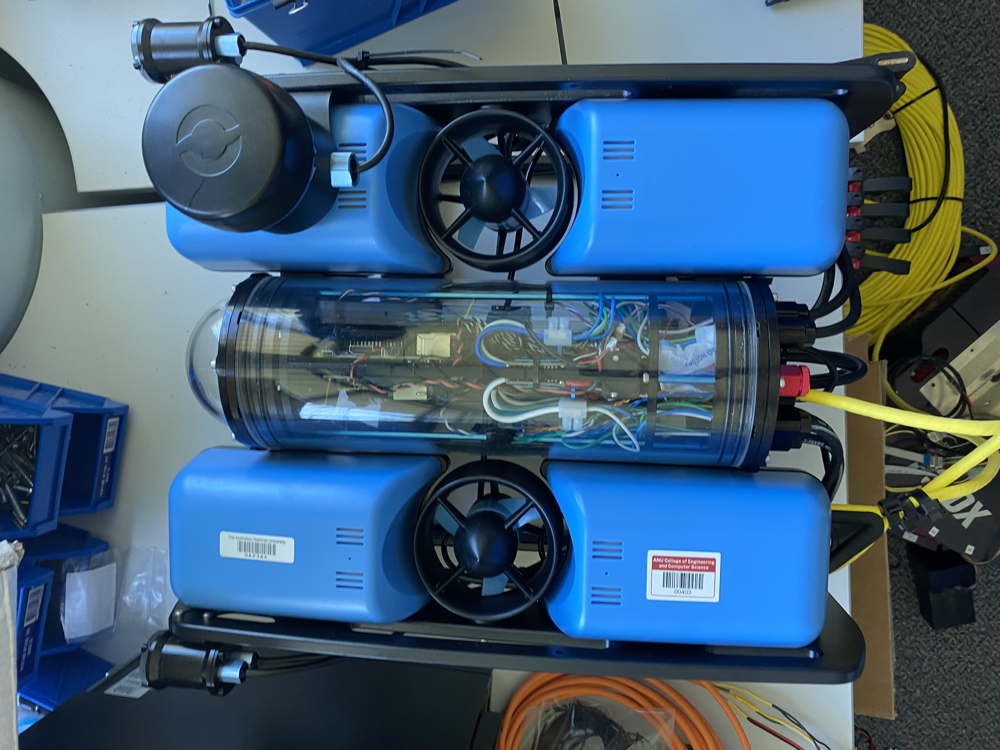
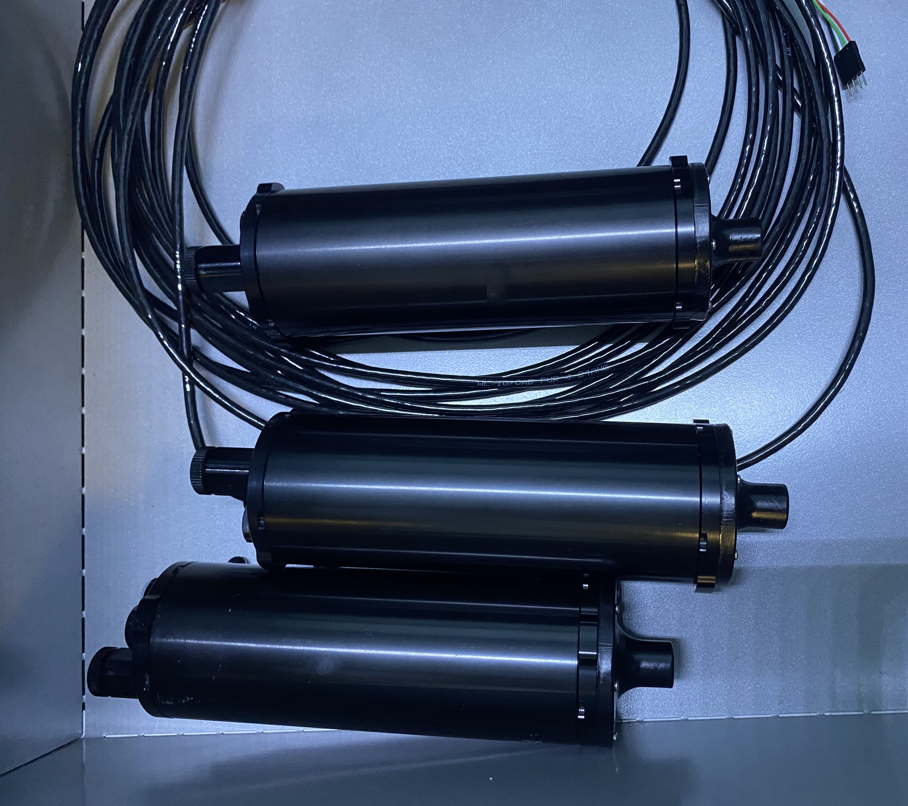

# Multi-beacon-ranging-system-for-underwater-robotics

This project aims to develop a sonar system capable of measuring underwater range to three beacons, expanding
on existing hardware that supports one beacon. An undergraduate thesis is available for reference. The project
involves upgrading the system, programming a microprocessor for precise timing, validating performance through
experiments, and implementing a real-time data collection system integrating ranging signals, RTK-GPS, and
IMU, mounted on a boat. The collected data will support 3D underwater range SLAM research. Required skills
include microprocessor programming, signal processing, and Python. The project excludes SLAM algorithm
development. Students relinquish intellectual property rights over collected data and code, which will support a
research publication where they will be acknowledged but not listed as authors. Expected outcomes include a
validated multi-beacon sonar system, a real-time data collection system, and a high-quality dataset for further
research.

### Project Status

### Shared Folder for all Documentation
https://anu365-my.sharepoint.com/:f:/g/personal/u7810272_anu_edu_au/Ej7ByPz3ustMnYEdPVlyXrsB3ky1SCxQRNfJEJSD3o6qvw?e=D4FFSC

### The Drone!

### The Beacon!

### The Testing Ground!

